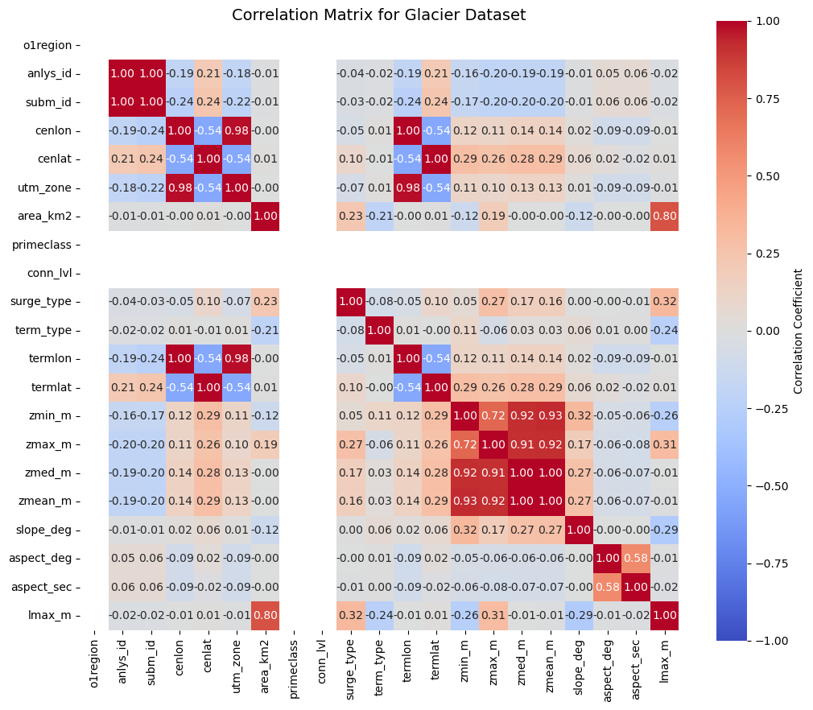
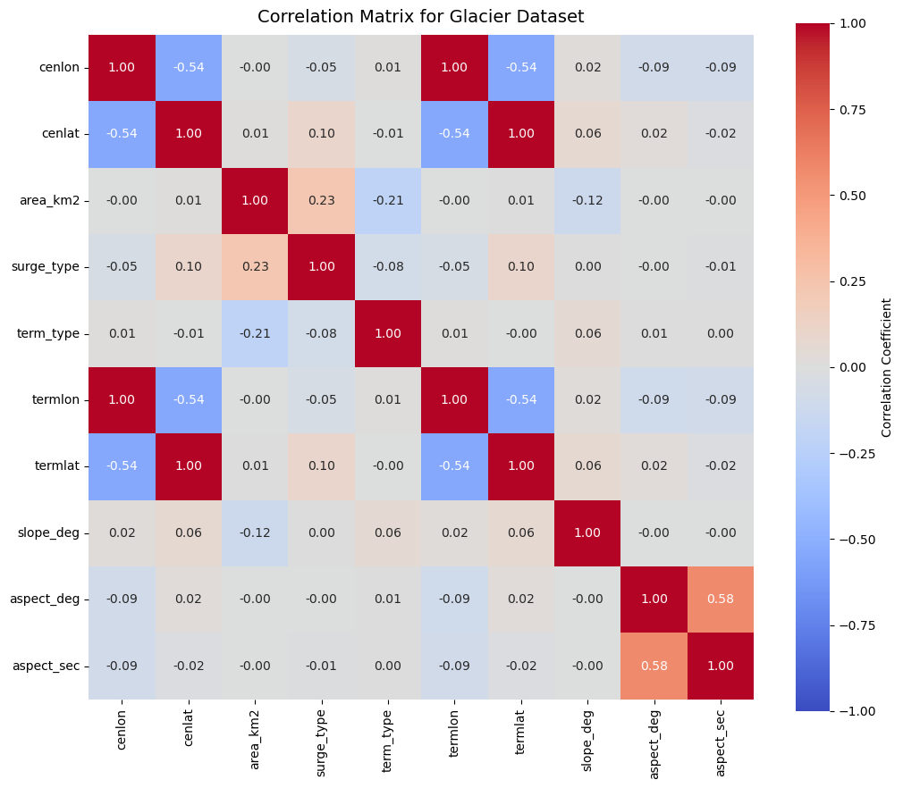
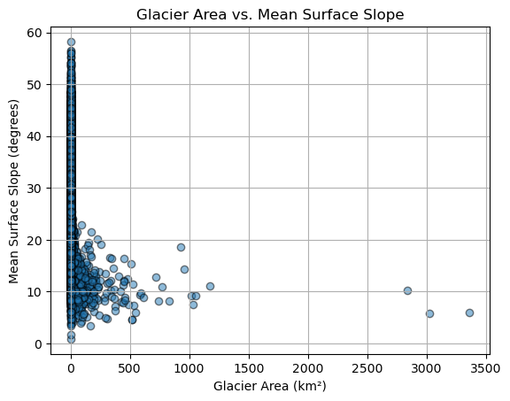
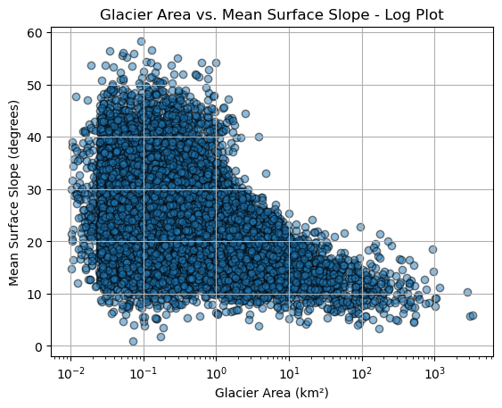
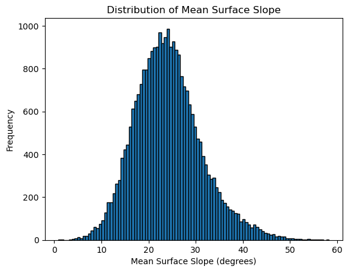
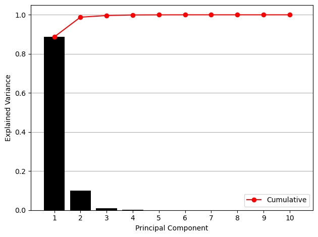
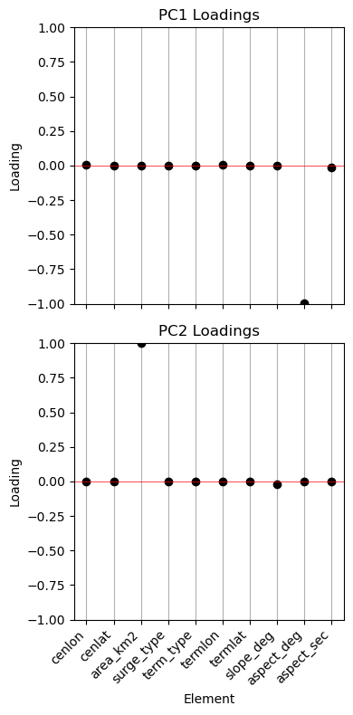

## PCA Feature Selection: Alaska Glaciers (Assignment 06)

### Sophia Robillard and Dahlia Gietka

## Step 1. Uploaded glacial data (csv) from course Google Drive into SophiaDahlia folder in VSCode

## Step 2. Imported dependencies and read the data using pandas

## Step 3. Inspected the columns to assess which features would be most suitable for a PCA

## Step 4. Filtered out any columns that provide data in a non-desireable format (i.e. strings)

## Step 5. Created a correlation matrix to assess which features are most strongly correlated

- Used the correlation matrix function and a heat map to visually identify important and related variables, creating Correlation Matrix for Glacier Dataset
- This correlation map then allowed us to visually identify which features could be further dropped.

*Figure 1: First correlation matrix of glacial features (before more narrowing down)

## Step 6. Narrowed features down to the following:

- cenlon 
- cenlat 
- area_km2
- surge_type
- term_type
- termlon
- termlat
- slope_deg
- aspect_deg
- aspect_sec

## Step 7. Created a new correlation matrix with only the features from Step 6 (for clearer visualization), which narrowed down features to the following:
- area_km2
- slope_deg

*Figure 2: Refined correlation matrix of glacial features (after further narrowing down)

## Step 7. Created scatter plots and histograms of features from Step 7

To see the distribution of selcted variables and outliers.

*Figure 2: Glacier area vs mean surface slope scatter plot

*Figure 2: Glacier area vs mean surface slope scatter log plot

*Figure 2: Distribution of mean surface slope

## Step 8. The PCA! 
- dropped NaN values 
- centered the data by subtracting the mean
- applied Singular Value Decomposition (SVD)
- projected data onto principal components
- calculated the explained variance ratio 

Explained variance:
  PC1: 0.8869 (88.69%)
  PC2: 0.1010 (10.10%)
  PC3: 0.0084 (0.84%)
  PC4: 0.0029 (0.29%)
  PC5: 0.0005 (0.05%)
  PC6: 0.0003 (0.03%)
  PC7: 0.0000 (0.00%)
  PC8: 0.0000 (0.00%)
  PC9: 0.0000 (0.00%)
  PC10: 0.0000 (0.00%)

## Step 9. Created a Scree Plot
This provides us with a visual representation of the explained variance of each principal component.

*Figure 2: Scree plot (principal component vs explained variance)

## Step 10. Determined and visualized loadings for PC1 and PC2

*Figure 2: Loadings for PC1 and PC2
