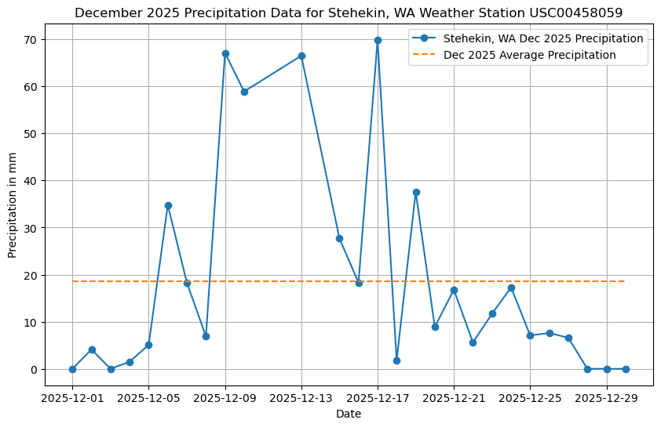
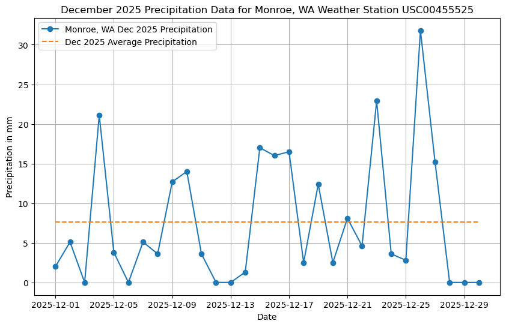

## Paleo Rocks Group (Dahlia, Lucy, Laura, Sophia R.)

In December 2025, heavy rain, falling over recently burned land, caused debris flows in the North Cascades (namely Stehekin, WA). The recent burn created aquophobic soils, increasing vulnerability to saturation, overland flow, and ultimately debris flows. Data from NOAA, the weather service, and USGS provide insights into the severity of hydrologic conditions leading up to, during, and after this event. Data from December 2024 (one year before the heavy rains of December 2025) are also used to provide context and comparison, highlighting just how intense the conditions of December 2025 were. Plots were created to visualize these conditions over time. Data from Monroe WA are also included, as this area was also affected by the severe weather conditions of December 2025.

## Data Visualization

*Figure 1: Daily precipitation from Stehekin, WA Dec 2024, NOAA

*Figure 2: Daily precipitation from Stehekin, WA Dec 2025, NOAA

*Figure 3: Daily precipitation from Monroe, WA Dec 2024, NOAA

*Figure 4: Daily precipitation from Monroe, WA Dec 2025, NOAA

*Figure 5: Daily stream gauge discharge Stehekin WA, Dec 2025, USGS

*Figure 6: Monthly stream gauge disharge Stehekin WA, 2025, USGS
 
# Steps 
1. Google search to find publicly available weather and stream gauge data from NOAA, weather.gov, and USGS
2. Used online resources to determine API URL structures 
3. Built code based off of the Sepkoski Curve assignment, but instead of faunal data we inputted the USGS and weather URLs
4. Used 'response' and 'print' to download CSV data from API URLs
5. Used 'DataFile' to read the CSVs and then 'print' to inspect the column
6. From NOAA Stehekin, WA precipitation data, created plots of 1) precipitation in mm vs time (December 2025) (Figure 1) and 2) precipitation in mm vs time (December 2024) (for contextualization) (Figure 2)
7. From NOAA Monroe, WA precipitation data, created plots of 1) precipitation in mm vs time (December 2025) (Figure 3) and 2) precipitation in mm vs time (December 2024) (for contextualization) (Figure 4)
8. From USGS Stehekin WA stream gauge discharge data, created plots of 1) discharge vs time (days of December 2025) (Figure 5) and 2) discharge vs time (months of 2025) (Figure 6)

## Data Access:
# Weather (NOAA, Weather Service)
- https://api.weather.gov/
- https://www.weather.gov/wrh/Climate?wfo=otx 

# Stream Gauge (USGS)
- https://api.waterdata.usgs.gov/ogcapi/v0/collections/daily?f=json&lang=en-US&monitoring_location_id=USGS-1245100&datetime=2025-12-01/2025-12-31&parameter_code=00060&statistic_id=0003 

[def]: StehekinPrecip2024.png