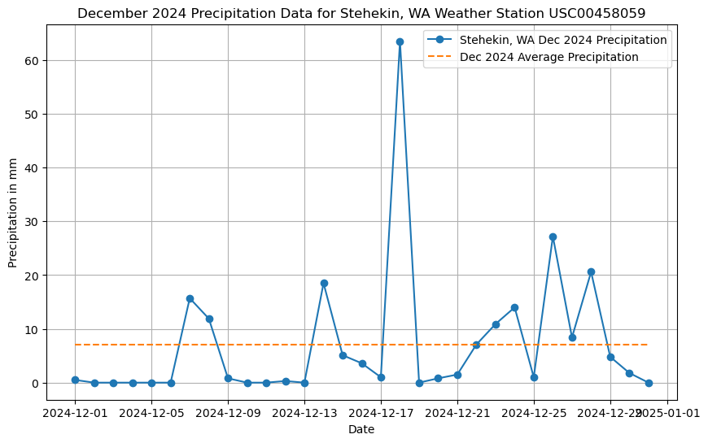
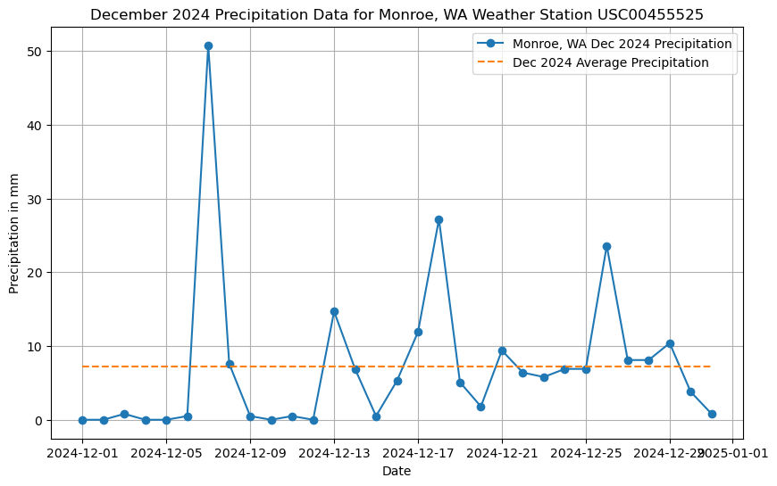
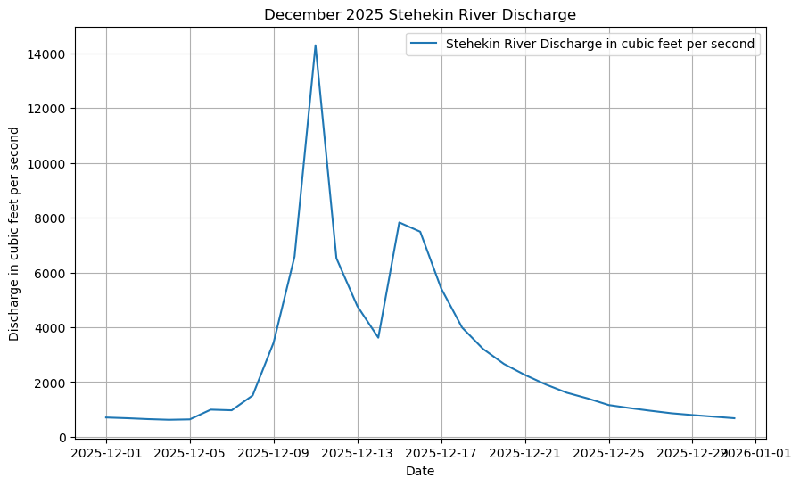
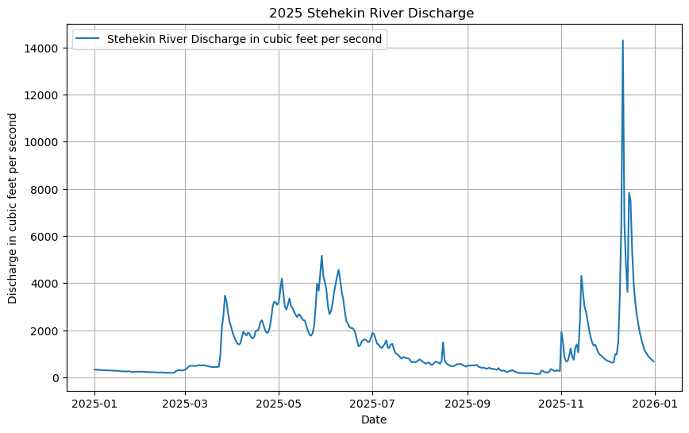

## Paleo Rocks Group (Dahlia, Lucy, Laura, Sophia R.)

In December 2025, heavy rain, falling over recently burned land, caused debris flows in the North Cascades (namely Stehekin, WA). The recent burn created aquophobic soils, increasing vulnerability to saturation, overland flow, and ultimately debris flows. Data from NOAA, the weather service, and USGS provide insights into the severity of hydrologic conditions leading up to, during, and after this event. Data from December 2024 (one year before the heavy rains of December 2025) are also used to provide context and comparison, highlighting just how intense the conditions of December 2025 were. Plots were created to visualize these conditions over time. Data from Monroe, WA are also included, as this area was also affected by the severe weather conditions of December 2025.

## Data Visualization

*Figure 1: Daily precipitation from Stehekin, WA Dec 2024, NOAA

*Figure 2: Daily precipitation from Stehekin, WA Dec 2025, NOAA

All precipitation data was taken from NOAA, and precipitation was measured in millimeters. Precipitation was measured at the Stehekin 4 Northwest Station, station number GHCND:USC00458059. Monroe precipitation data was taken from the Monroe, WA station, station number GHCND:USC00455525. Average precipitation over December 2024 and December 2024 was calculated from the data for each location. We see that average daily precipitation in Decemeber 2025 was more than double the average daily precipitation in December 2024. Additionally, we see the highest spikes in precipitation in 2025 from December 11th - 13th. According to a KING5 News Article and Northwest Public Broadcasting, articles linked below, this was when the major debris flows occurred in Stehekin, WA. 

*Figure 3: Daily precipitation from Monroe, WA Dec 2024, NOAA

*Figure 4: Daily precipitation from Monroe, WA Dec 2025, NOAA

*Figure 5: Daily stream gauge discharge Stehekin WA, Dec 2025, USGS

*Figure 6: Daily stream gauge disharge Stehekin WA, 2025, USGS

Stream gauge data was taken from USGS, and the value measured was river discharge in cubic feet per second. Stream gauge data was taken from the Stehekin River, site number 12451000. As above, we see that the largest spikes in discharge occur during the same period in which major debris flows were experienced. It is also clear that discharge in December 2025 was significantly larger in volume when compared to the rest of 2025. 
 
# Steps 
1. Google search to find publicly available weather and stream gauge data from NOAA and USGS
2. Used online resources to determine API URL structures 
3. Built code based off of the Sepkoski Curve assignment, but instead of faunal data we input the USGS and weather URLs
4. Used 'response' and associated methods to download an format json data from API URLs
5. Used Pandas 'DataFile' to read the json files and then 'print' to inspect the column
6. From NOAA Stehekin, WA precipitation data, created plots of 1) precipitation in mm vs time (December 2025) (Figure 1) and 2) precipitation in mm vs time (December 2024) (for contextualization) (Figure 2)
7. From NOAA Monroe, WA precipitation data, created plots of 1) precipitation in mm vs time (December 2025) (Figure 3) and 2) precipitation in mm vs time (December 2024) (for contextualization) (Figure 4)
8. From USGS Stehekin WA stream gauge discharge data, created plots of 1) discharge vs time (days of December 2025) (Figure 5) and 2) discharge vs time (months of 2025) (Figure 6)

# Data Access
## Weather (NOAA, Weather Service)
### Stehekin, WA: 
- https://www.ncei.noaa.gov/cdo-web/api/v2/data?datasetid=GHCND&stationid=GHCND:USC00458059&&units=metric&datatype=PRCP&limit=1000&startdate=2025-12-01&enddate=2025-12-31
- https://www.ncei.noaa.gov/cdo-web/api/v2/data?datasetid=GHCND&stationid=GHCND:USC00458059&&units=metric&datatype=PRCP&limit=1000&startdate=2024-12-01&enddate=2024-12-31

### Monroe, WA:
- https://www.ncei.noaa.gov/cdo-web/api/v2/data?datasetid=GHCND&stationid=GHCND:USC00455525&&units=metric&datatype=PRCP&limit=1000&startdate=2025-12-01&enddate=2025-12-31
- https://www.ncei.noaa.gov/cdo-web/api/v2/data?datasetid=GHCND&stationid=GHCND:USC00455525&&units=metric&datatype=PRCP&limit=1000&startdate=2024-12-01&enddate=2024-12-31

## Stream Gauge (USGS)
- https://api.waterdata.usgs.gov/ogcapi/v0/collections/daily?f=json&lang=en-US&monitoring_location_id=USGS-1245100&datetime=2025-12-01/2025-12-31&parameter_code=00060&statistic_id=0003 

## Debris Flow News Articles
- https://www.king5.com/article/news/local/debris-flow-devastates-town-stehekin-washington-flooding/281-949f09bc-0261-4f6c-bd18-9d3ca8eb1385
- https://www.nwpb.org/2025-12-13/remote-towns-in-wa-hit-hard-by-floods-mudslides-leaving-some-residents-isolated

[def]: StehekinPrecip2024.png