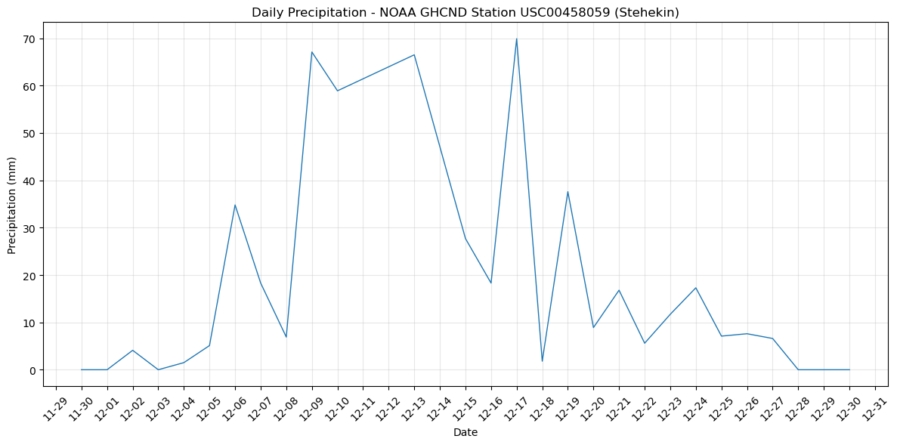
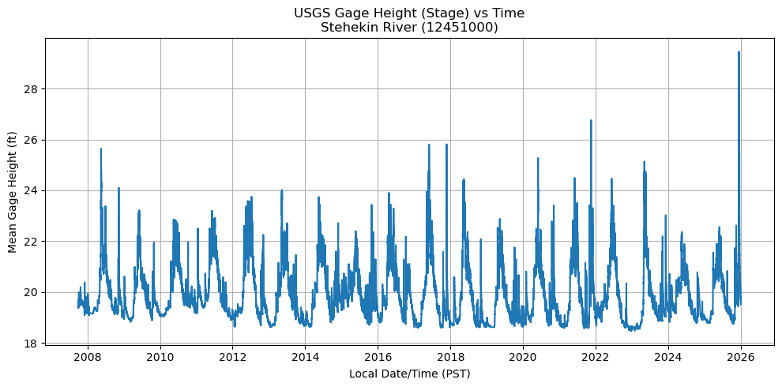
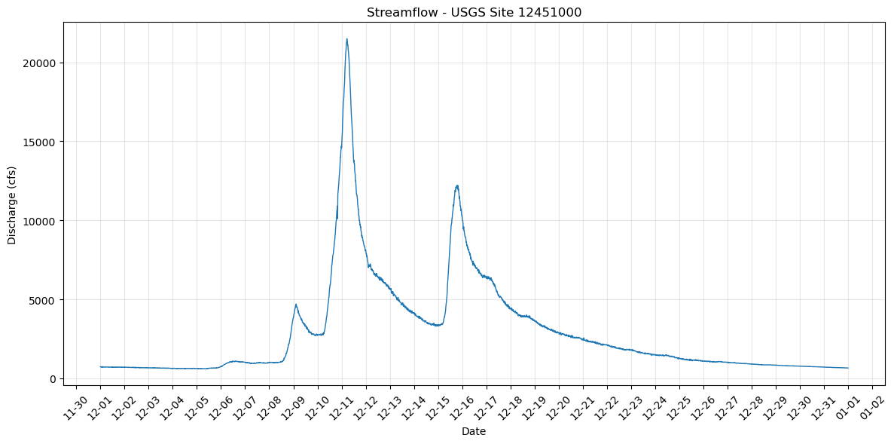

# Climatic Context for the December 2025 Stehekin Debris Flow Event

## Overview
In December 2025, heavy rainfall on recently burned areas caused debris flows in the North Cascades, near 
Stehekin, Washington. This document offers climate context for the event using publicly available 
precipitation and streamflow data from NOAA and USGS APIs.
The goal is to assess whether December 2025 saw unusually high precipitation and river discharge that may 
have led to slope failure and debris flows. 

## Results and Interpretation
Daily precipitation data indicate several storm events in December 2025, with rainfall increasing in early 
and mid-December. The most significant storm happened on **December 17**, recording the highest daily total 
of about 70 mm. This peak followed multiple days of heavy rainfall, suggesting the soil was already 
saturated.

USGS stream gauge data from the Stehekin River indicate a significant hydrologic response to these storm 
events. During mid-December, river stage and discharge quickly rose, with peak discharge surpassing 20,000 
cfs.

The heavy rainfall and rapid river rise in December 2025 indicate a significant storm event. The recent burn 
area increased debris-flow risk by increasing runoff and destabilizing slopes.

## Reproducibility

All precipitation and streamflow data were collected programmatically using public APIs (NOAA CDO and USGS 
Water Services) and processed using Python with help from ChatGPT (see `API_clouds_assignment` file).

- **NOAA GHCND (USC00458059)**: Daily precipitation (mm)  
  <https://www.ncei.noaa.gov/cdo-web/api/v2/data>

- **USGS Gauge 12451000**: Stehekin River discharge (cfs) & gage height (ft)  
  
<https://waterservices.usgs.gov/nwis/iv/?sites=12451000&agencyCd=USGS&startDT=2025-12-10T00:00:00.000-08:00&endDT=2025-12-13T23:59:59.999-08:00&parameterCd=00065&format=rdb>

