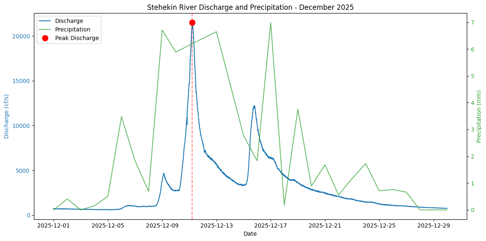
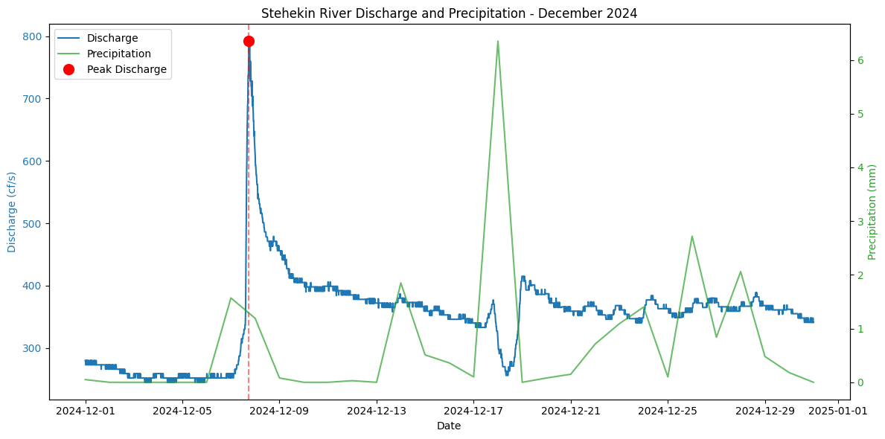

# Washington December 2025 Flood Event Analysis

## Overview
This notebook gathers data for the December 2025 flood event in Washington State by combining river discharge data from USGS with precipitation data from NOAA.

## Context: December 2025 Flood Event
In December 2025, Washington State experienced significant flooding events characterized by extreme precipitation, debris flows and elevated river discharge levels. This notebook gathers data to characterize the vent in the zone of Stehekin, Washington.

## Data Sources

### 1. USGS Water Services API
- **Purpose**: Real-time river discharge (streamflow) data
- **Site**: 12451000 (Stehekin River at Stehekin, WA)
- **Parameter**: 00060 (Discharge in cubic feet per second)
- **Time Period**: December 1-31, 2025
- **Endpoint**: `https://waterservices.usgs.gov/nwis/iv/`
- **Documentation**: [USGS Water Services](https://waterservices.usgs.gov/rest/IV-Service.html)

### 2. NOAA Climate Data Online (CDO) API
- **Purpose**: Daily precipitation measurements
- **Station**: GHCND:USC00458059 (Stehekin 4 NW, WA US)
- **Data Type**: PRCP (Daily precipitation)
- **Time Period**: December 1-31, 2025
- **Endpoint**: `https://www.ncei.noaa.gov/cdo-web/api/v2/data`
- **Documentation**: [NOAA CDO Web Services](https://www.ncei.noaa.gov/cdo-web/webservices/v2)
- **Authentication**: Requires API token (request at [NOAA CDO Token Request](https://www.ncdc.noaa.gov/cdo-web/token))

## Workflow Steps

### Step 1: Import Libraries
Required Python packages:
- `requests`: API calls
- `pandas`: Data manipulation
- `matplotlib`: Visualization
- `json`: Data parsing

### Step 2: Retrieve USGS Discharge Data
Make a GET request to USGS Water Services API with parameters.
Parse the nested JSON response to extract discharge values with timestamps.

### Step 3: Retrieve NOAA Precipitation Data
Make a GET request to NOAA CDO API with parameters, using a token.

### Step 4: Visualization
Create a dual-axis plot showing:
- Convert timestamps to pandas datetime objects
- handle different datetime formats
- **Left axis (blue)**: River discharge (cfs)
- **Right axis (green)**: Precipitation (mm/10)
- **Peak marker (red)**: Maximum discharge event

## API Best Practices
1. **Use parameters**: Pass query parameters as dictionaries rather than embedding them in URLs
2. **Error handling**: Use `raise_for_status()` to catch HTTP errors
3. **Authentication**: Keep API tokens secure and never commit them to public repositories (this is not the case in this example)

## Insights 
These data (river gauge and precipitation) show a clear peak during mid december (december 11th), the precipitation data shows a build up before the discharge peak when the floods occurred.

## Historical information context
Looking at data from 2024 precipitation and river discharge for the same place, it is clear that decmber tends to be a month with high precipitation every year, but the 2025 events were more intense than in previous years.
