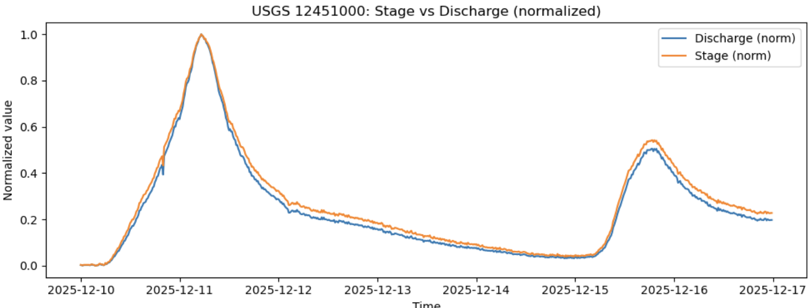
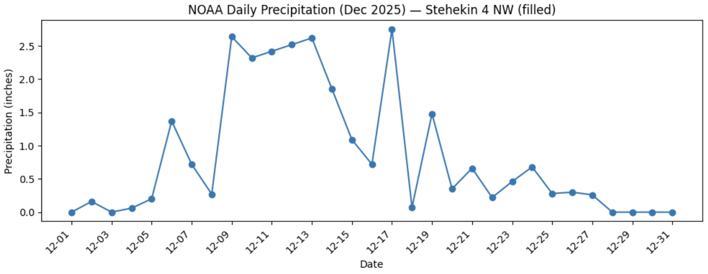
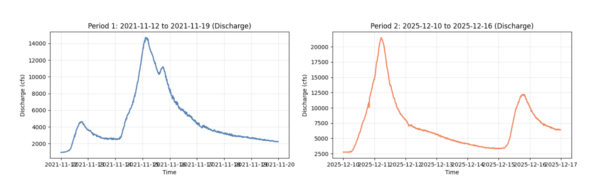
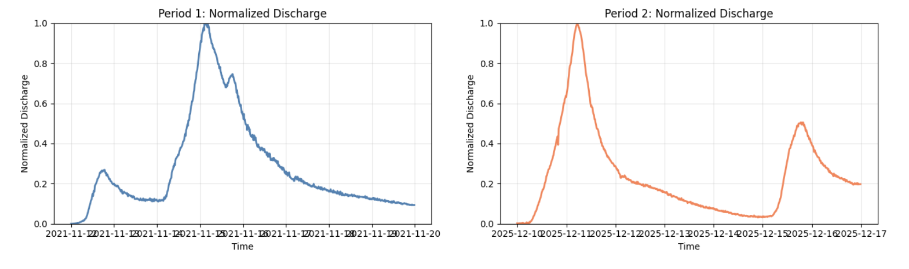

# Washington Flood Data Analysis 

## Overview

In December 2025, heavy rainfall in the North Cascades triggered debris flows in areas recently burned by wildfires, particularly near Stehekin, Washington. After wildfires, vegetation that normally stabilizes hillslopes is removed and soils become water-repellent (hydrophobic), causing rainfall to run off rapidly rather than infiltrate. When intense rain fell on these compromised slopes, water mixed with loose soil, ash, and rock to form fast-moving debris flows that accelerated down steep channels into streams and valleys.

These notebooks retrieve and analyze publicly available data from USGS and NOAA APIs to provide climatic and hydrologic context for the December 2025 event.

---

## Output Files

### Graphs

#### 1. Stage vs. Discharge (Normalized)



**What it shows:** This graph displays both water level (stage, in orange) and flow rate (discharge, in blue) from the Stehekin River gauge during December 10-16, 2025. Both variables are normalized to a 0-1 scale to allow direct comparison despite having different units (feet vs. cubic feet per second).

**Observations:**
- A dramatic peak occurs on December 11, 2025, when both stage and discharge reach their maximum values
- Stage and discharge track each other closely, as expected for a single-channel stream
- A secondary, smaller peak appears around December 15-16, indicating a second storm pulse
- The sharp rise and fall of the hydrograph indicates rapid runoff with limited infiltration-characteristic of post-fire watershed conditions

---

#### 2. Daily Precipitation (December 2025)




**What it shows:** Daily precipitation totals (in inches) recorded at the Stehekin 4 NW weather station throughout December 2025.

**Observations:**
- Heavy precipitation occurred December 9-14, with daily totals exceeding 2.5 inches on multiple days
- Peak daily precipitation of nearly 2.75 inches occurred around December 10 and again on December 17
- The sustained multi-day rainfall (December 9-14) saturated soils and generated the runoff that caused the debris flows
- A second precipitation event around December 17-19 corresponds to the secondary discharge peak seen in the hydrographs

---

#### 3. Discharge Comparison (Raw Values)



**What it shows:** Side-by-side comparison of stream discharge (in cubic feet per second) between two flood events:
- **Left panel:** November 12-19, 2021 (previous major flood event)
- **Right panel:** December 10-16, 2025 (current debris flow event)

**Observations:**
- The 2025 event (right) reached a **higher peak discharge** (~21,500 cfs) compared to 2021 (~14,700 cfs)
- The 2025 event shows a **steeper rising limb**, indicating more rapid runoff generation
- Both events show secondary peaks, but the 2025 event's initial spike is more pronounced
- The 2021 event has a broader peak and slower recession, suggesting more sustained rainfall or snowmelt contributions

**Summary Statistics:**
| Metric | November 2021 | December 2025 |
|--------|---------------|---------------|
| Min Discharge | 945 cfs | 2,710 cfs |
| Max Discharge | 14,700 cfs | 21,500 cfs |
| Mean Discharge | 4,823 cfs | 7,298 cfs |
| Records | 768 | 672 |

---

#### 4. Normalized Discharge Comparison



**What it shows:** The same two flood events with discharge normalized to a 0-1 scale (where 1.0 = peak discharge for each event). This removes magnitude differences and allows comparison of the **shape** of the hydrologic response.

**Observations:**
- The December 2025 event (right, orange) rises **more abruptly** than the November 2021 event (left, blue)
- Peak flow is reached more quickly in 2025, indicating rapid runoff with minimal lag time
- The 2025 hydrograph has a **sharper, more triangular shape**, while 2021 has a broader, more rounded peak
- The sharp rise and fall in 2025 suggests limited infiltration and storage capacity-consistent with runoff over burned, hydrophobic soils

---

## Data Files (CSV)

These files are saved to the `data/` folder when the notebooks are run:

| File | Description |
|------|-------------|
| `usgs_12451000_iv_discharge_2025-12-10_to_2025-12-16.csv` | Instantaneous discharge measurements (cfs) from the December 2025 event |
| `usgs_12451000_iv_stage_2025-12-10_to_2025-12-16.csv` | Instantaneous stage measurements (ft) from the December 2025 event |
| `usgs_12451000_iv_discharge_2021-11-12_to_2021-11-19.csv` | Discharge measurements from the November 2021 comparison event |
| `usgs_12451000_iv_stage_2021-11-12_to_2021-11-19.csv` | Stage measurements from November 2021 (if available) |
| `noaa_USC00458059_PRCP_2025-12-01_to_2025-12-31.csv` | Daily precipitation totals for December 2025 |

---

## Console Output

**From `notebook_API_assignment.ipynb`:**
```
Peak discharge (cfs): 21500
Peak time: 2025-12-11 05:15:00 PST
```

**From `discharge_comp.ipynb`:**
```
Comparative Summary:
Period 1 (2021-11-12 to 2021-11-19): 768 discharge records
  Min discharge: 945.00 cfs
  Max discharge: 14700.00 cfs
  Mean discharge: 4823.23 cfs

Period 2 (2025-12-10 to 2025-12-16): 672 discharge records
  Min discharge: 2710.00 cfs
  Max discharge: 21500.00 cfs
  Mean discharge: 7298.12 cfs
```

---

## Data Sources

| Source | API Endpoint | Data Type |
|--------|--------------|-----------|
| USGS Water Services | `waterservices.usgs.gov/nwis/iv/` | Instantaneous discharge (parameter 00060) and stage (parameter 00065) |
| USGS Site Service | `waterservices.usgs.gov/nwis/site/` | Station metadata |
| NOAA NCEI | `ncei.noaa.gov/access/services/data/v1` | Daily precipitation summaries |
| NOAA CDO | `ncdc.noaa.gov/cdo-web/api/v2/data` | GHCND daily climate data |

---

## Station Information

- **USGS Stream Gauge:** 12451000 - Stehekin River at Stehekin, WA  
  - Coordinates: 48.33°N, 120.69°W  
  - HUC: 17020009

- **Weather Station:** USC00458059 - Stehekin 4 NW, WA

---


